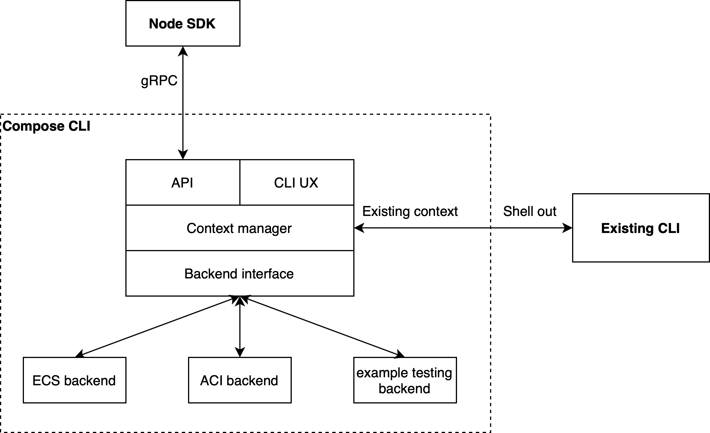

# Architecture

This CLI has the following high level design goals:
1. Provide a way for the Docker experience to be mapped to different container
   runtimes
1. Provide a way to automatically generate high quality SDKs in popular
   languages
1. Ensure that existing Docker CLI commands continue to work as before

These constraints resulted in the following architecture:

What follows is a list of useful links to help navigate the code:
* The CLI UX code is in [`cli/`](../cli)
* The backend interface is defined in [`backend/`](../backend)
* The API is defined by protobufs that can be found in [`protos/`](../protos)
* The API server is in [`server/`](../server)
* The context management and interface can be found in [`context/`](../api/context)
* The Node SDK is autogenerated (except for default endpoints managed by Docker Desktop), and can be found in
  [`docker/node-sdk`](https://github.com/docker/node-sdk)