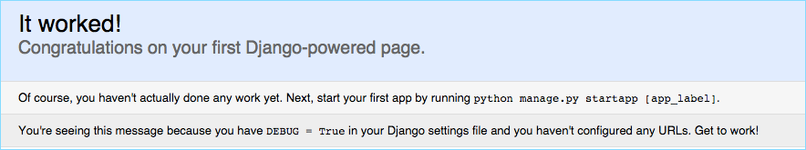

<!--[metadata]>
+++
title = "Quickstart: Compose and Django"
description = "Getting started with Docker Compose and Django"
keywords = ["documentation, docs,  docker, compose, orchestration, containers"]
[menu.main]
parent="workw_compose"
weight=4
+++
<![end-metadata]-->

# Quickstart: Docker Compose and Django

This quick-start guide demonstrates how to use Docker Compose to set up and run a simple Django/PostgreSQL app. Before starting, you'll need to have
[Compose installed](install.md).

### Define the project components

For this project, you need to create a Dockerfile, a Python dependencies file,
and a `docker-compose.yml` file.

1. Create an empty project directory.

    You can name the directory something easy for you to remember. This directory is the context for your application image. The directory should only contain resources to build that image.

2. Create a new file called `Dockerfile` in your project directory.

    The Dockerfile defines an application's image content via one or more build
    commands that configure that image. Once built, you can run the image in a
    container.  For more information on `Dockerfiles`, see the [Docker user
    guide](/engine/userguide/containers/dockerimages.md#building-an-image-from-a-dockerfile)
    and the [Dockerfile reference](/engine/reference/builder.md).

3. Add the following content to the `Dockerfile`.

        FROM python:2.7
        ENV PYTHONUNBUFFERED 1
        RUN mkdir /code
        WORKDIR /code
        ADD requirements.txt /code/
        RUN pip install -r requirements.txt
        ADD . /code/

    This `Dockerfile` starts with a Python 2.7 base image. The base image is
    modified by adding a new `code` directory. The base image is further modified
    by installing the Python requirements defined in the `requirements.txt` file.

4. Save and close the `Dockerfile`.

5. Create a `requirements.txt` in your project directory.

    This file is used by the `RUN pip install -r requirements.txt` command in your `Dockerfile`.

6. Add the required software in the file.

        Django
        psycopg2

7. Save and close the `requirements.txt` file.

8. Create a file called `docker-compose.yml` in your project directory.

    The `docker-compose.yml` file describes the services that make your app. In
    this example those services are a web server and database.  The compose file
    also describes which Docker images these services use, how they link
    together, any volumes they might need mounted inside the containers.
    Finally, the `docker-compose.yml` file describes which ports these services
    expose. See the [`docker-compose.yml` reference](compose-file.md) for more
    information on how this file works.

9. Add the following configuration to the file.

        version: '2'
        services:
          db:
            image: postgres
          web:
            build: .
            command: python manage.py runserver 0.0.0.0:8000
            volumes:
              - .:/code
            ports:
              - "8000:8000"
            depends_on:
              - db

    This file defines two services: The `db` service and the `web` service.

10. Save and close the `docker-compose.yml` file.

### Create a Django project

In this step, you create a Django started project by building the image from the build context defined in the previous procedure.

1. Change to the root of your project directory.

2. Create the Django project using the `docker-compose` command.

        $ docker-compose run web django-admin.py startproject composeexample .

    This instructs Compose to run `django-admin.py startproject composeeexample`
    in a container, using the `web` service's image and configuration. Because
    the `web` image doesn't exist yet, Compose builds it from the current
    directory, as specified by the `build: .` line in `docker-compose.yml`.

    Once the `web` service image is built, Compose runs it and executes the
    `django-admin.py startproject` command in the container. This command
    instructs Django to create a set of files and directories representing a
    Django project.

3. After the `docker-compose` command completes, list the contents of your project.

        $ ls -l
        drwxr-xr-x 2 root   root   composeexample
        -rw-rw-r-- 1 user   user   docker-compose.yml
        -rw-rw-r-- 1 user   user   Dockerfile
        -rwxr-xr-x 1 root   root   manage.py
        -rw-rw-r-- 1 user   user   requirements.txt

  If you are running Docker on Linux, the files `django-admin` created are owned
  by root. This happens because the container runs as the root user. Change the
  ownership of the the new files.

          sudo chown -R $USER:$USER .

  If you are running Docker on Mac or Windows, you should already have ownership
  of all files, including those generated by `django-admin`. List the files just
  verify this.

        $ ls -l
        total 32
        -rw-r--r--  1 user  staff  145 Feb 13 23:00 Dockerfile
        drwxr-xr-x  6 user  staff  204 Feb 13 23:07 composeexample
        -rw-r--r--  1 user  staff  159 Feb 13 23:02 docker-compose.yml
        -rwxr-xr-x  1 user  staff  257 Feb 13 23:07 manage.py
        -rw-r--r--  1 user  staff   16 Feb 13 23:01 requirements.txt

### Connect the database

In this section, you set up the database connection for Django.

1. In your project directory, edit the `composeexample/settings.py` file.

2. Replace the `DATABASES = ...` with the following:

        DATABASES = {
            'default': {
                'ENGINE': 'django.db.backends.postgresql_psycopg2',
                'NAME': 'postgres',
                'USER': 'postgres',
                'HOST': 'db',
                'PORT': 5432,
            }
        }

    These settings are determined by the
    [postgres](https://hub.docker.com/_/postgres/) Docker image
    specified in `docker-compose.yml`.

3. Save and close the file.

4. Run the `docker-compose up` command.

        $ docker-compose up
        Starting composepractice_db_1...
        Starting composepractice_web_1...
        Attaching to composepractice_db_1, composepractice_web_1
        ...
        db_1  | PostgreSQL init process complete; ready for start up.
        ...
        db_1  | LOG:  database system is ready to accept connections
        db_1  | LOG:  autovacuum launcher started
        ..
        web_1 | Django version 1.8.4, using settings 'composeexample.settings'
        web_1 | Starting development server at http://0.0.0.0:8000/
        web_1 | Quit the server with CONTROL-C.

    At this point, your Django app should be running at port `8000` on your
    Docker host. If you are using a Docker Machine VM, you can use the
    `docker-machine ip MACHINE_NAME` to get the IP address.

    

## More Compose documentation

- [User guide](index.md)
- [Installing Compose](install.md)
- [Getting Started](gettingstarted.md)
- [Get started with Rails](rails.md)
- [Get started with WordPress](wordpress.md)
- [Command line reference](./reference/index.md)
- [Compose file reference](compose-file.md)
