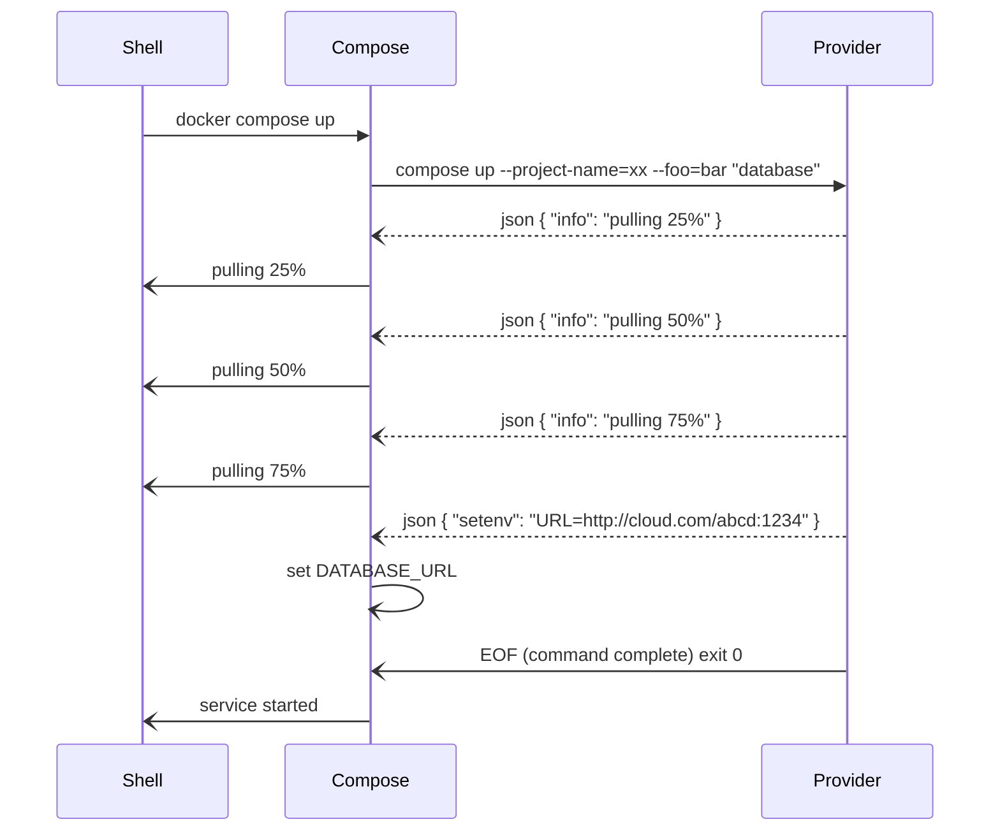

# About

The Compose application model defines `service` as an abstraction for a computing unit managing (a subset of)
application needs, which can interact with other service by relying on network(s). Docker Compose is designed 
to use the Docker Engine ("Moby") API to manage services as containers, but the abstraction _could_ also cover 
many other runtimes, typically cloud services or services natively provided by host.

The Compose extensibility model has been designed to extend the `service` support to runtimes accessible through
third-party tooling.

# Architecture

Compose extensibility relies on the `provider` attribute to select the actual binary responsible for managing
the resource(s) needed to run a service.

```yaml
  database:
    provider:
      type: awesomecloud
      options:
        type: mysql
        size: 256
        name: myAwesomeCloudDB
```

`provider.type` tells Compose the binary to run, which can be either:
- Another Docker CLI plugin (typically, `model` to run `docker-model`)
- An executable in user's `PATH`

If `provider.type` doesn't resolve into any of those, Compose will report an error and interrupt the `up` command.

To be a valid Compose extension, provider command *MUST* accept a `compose` command (which can be hidden)
with subcommands `up` and `down`.

## Up lifecycle

To execute an application's `up` lifecycle, Compose executes the provider's `compose up` command, passing 
the project name, service name, and additional options. The `provider.options` are translated 
into command line flags. For example:
```console
awesomecloud compose --project-name <NAME> up --type=mysql --size=256 "database"
```

> __Note:__ `project-name` _should_ be used by the provider to tag resources
> set for project, so that later execution with `down` subcommand releases 
> all allocated resources set for the project.

## Communication with Compose

Providers can interact with Compose using `stdout` as a channel, sending JSON line delimited messages.
JSON messages MUST include a `type` and a `message` attribute.
```json
{ "type": "info", "message": "preparing mysql ..." }
```

`type` can be either:
- `info`: Reports status updates to the user. Compose will render message as the service state in the progress UI
- `error`: Let's the user know something went wrong with details about the error. Compose will render the message as the reason for the service failure.
- `setenv`: Let's the plugin tell Compose how dependent services can access the created resource. See next section for further details.
- `debug`: Those messages could help debugging the provider, but are not rendered to the user by default. They are rendered when Compose is started with `--verbose` flag.



## Connection to a service managed by a provider

A service in the Compose application can declare dependency on a service managed by an external provider: 

```yaml
services:
  app:
    image: myapp 
    depends_on:
       - database

  database:
    provider:
      type: awesomecloud
```

When the provider command sends a `setenv` JSON message, Compose injects the specified variable into any dependent service,
automatically prefixing it with the service name. For example, if `awesomecloud compose up` returns:
```json
{"type": "setenv", "message": "URL=https://awesomecloud.com/db:1234"}
```
Then the `app` service, which depends on the service managed by the provider, will receive a `DATABASE_URL` environment variable injected
into its runtime environment.

> __Note:__  The `compose up` provider command _MUST_ be idempotent. If resource is already running, the command _MUST_ set
> the same environment variables to ensure consistent configuration of dependent services.

## Down lifecycle

`down` lifecycle is equivalent to `up` with the `<provider> compose --project-name <NAME> down <SERVICE>` command.
The provider is responsible for releasing all resources associated with the service.

## Provide metadata about options

Compose extensions *MAY* optionally implement a `metadata` subcommand to provide information about the parameters accepted by the `up` and `down` commands.  

The `metadata` subcommand takes no parameters and returns a JSON structure on the `stdout` channel that describes the parameters accepted by both the `up` and `down` commands, including whether each parameter is mandatory or optional.

```console
awesomecloud compose metadata
```

The expected JSON output format is:
```json
{
  "description": "Manage services on AwesomeCloud",
  "up": {
    "parameters": [
      {
        "name": "type",
        "description": "Database type (mysql, postgres, etc.)",
        "required": true,
        "type": "string"
      },
      {
        "name": "size",
        "description": "Database size in GB",
        "required": false,
        "type": "integer",
        "default": "10"
      },
      {
        "name": "name",
        "description": "Name of the database to be created",
        "required": true,
        "type": "string"
      }
    ]
  },
  "down": {
    "parameters": [
      {
        "name": "name",
        "description": "Name of the database to be removed",
        "required": true,
        "type": "string"
      }
    ]
  }
}
```
The top elements are:
- `description`: Human-readable description of the provider
- `up`: Object describing the parameters accepted by the `up` command
- `down`: Object describing the parameters accepted by the `down` command

And for each command parameter, you should include the following properties:
- `name`: The parameter name (without `--` prefix)
- `description`: Human-readable description of the parameter
- `required`: Boolean indicating if the parameter is mandatory
- `type`: Parameter type (`string`, `integer`, `boolean`, etc.)
- `default`: Default value (optional, only for non-required parameters)
- `enum`: List of possible values supported by the parameter separated by `,` (optional, only for parameters with a limited set of values)

This metadata allows Compose and other tools to understand the provider's interface and provide better user experience, such as validation, auto-completion, and documentation generation.

## Examples

See [example](examples/provider.go) for illustration on implementing this API in a command line 
