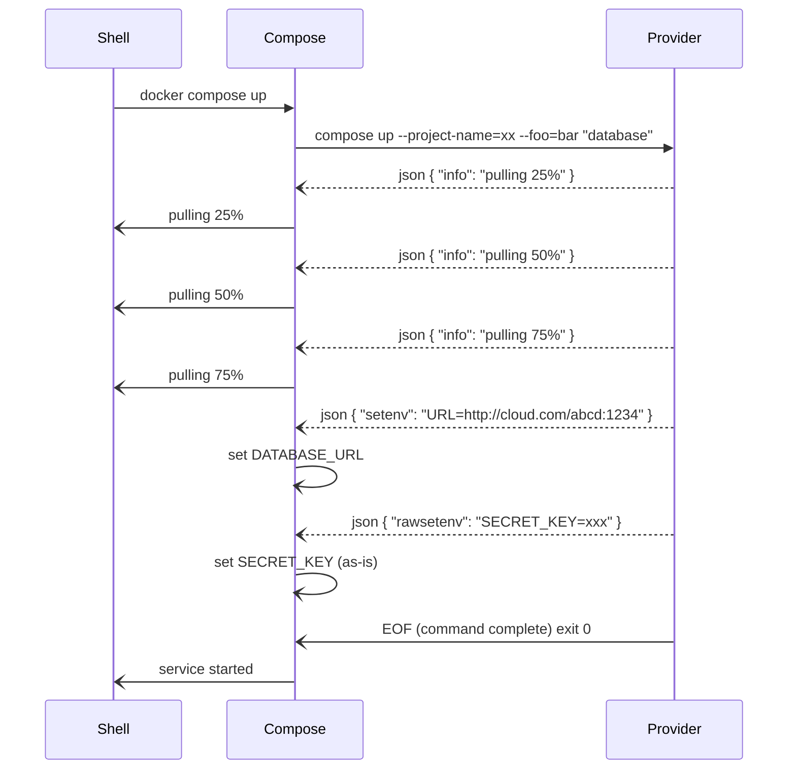

# About

The Compose application model defines `service` as an abstraction for a computing unit managing (a subset of)
application needs, which can interact with other services by relying on network(s). Docker Compose is designed 
to use the Docker Engine ("Moby") API to manage services as containers, but the abstraction _could_ also cover 
many other runtimes, typically cloud services or services natively provided by host.

The Compose extensibility model has been designed to extend the `service` support to runtimes accessible through
third-party tooling.

# Architecture

Compose extensibility relies on the `provider` attribute to select the actual binary responsible for managing
the resource(s) needed to run a service.

```yaml
  database:
    provider:
      type: awesomecloud
      options:
        type: mysql
        size: 256
        name: myAwesomeCloudDB
```

`provider.type` tells Compose the binary to run, which can be either:
- Another Docker CLI plugin (typically, `model` to run `docker-model`)
- An executable in user's `PATH`

If `provider.type` doesn't resolve into any of those, Compose will report an error and interrupt the `up` command.

To be a valid Compose extension, provider command *MUST* accept a `compose` command (which can be hidden)
with subcommands `up` and `down`. It *MAY* additionally implement a `stop` subcommand to support `docker compose stop`.

## Up lifecycle

To execute an application's `up` lifecycle, Compose executes the provider's `compose up` command, passing 
the project name, service name, and additional options. The `provider.options` are translated 
into command line flags. For example:
```console
awesomecloud compose --project-name <NAME> up --type=mysql --size=256 "database"
```

> __Note:__ `project-name` _should_ be used by the provider to tag resources
> set for project, so that later execution with `down` subcommand releases 
> all allocated resources set for the project.

## Communication with Compose

Providers can interact with Compose using `stdout` as a channel, sending JSON line delimited messages.
JSON messages MUST include a `type` and a `message` attribute.
```json
{ "type": "info", "message": "preparing mysql ..." }
```

`type` can be either:
- `info`: Reports status updates to the user. Compose will render message as the service state in the progress UI
- `error`: Lets the user know something went wrong with details about the error. Compose will render the message as the reason for the service failure.
- `setenv`: Lets the plugin tell Compose how dependent services can access the created resource. The variable is automatically prefixed with the service name. See next section for further details.
- `rawsetenv`: Same as `setenv`, but the variable is injected as-is without the service name prefix. Useful when applications require exact variable names that cannot be altered.
- `debug`: Those messages could help debugging the provider, but are not rendered to the user by default. They are rendered when Compose is started with `--verbose` flag.
- `addhost`: Injects an `extra_hosts` entry into every service depending on the provider service. The message is
  `"hostname=value"`, where value is an IP or the special `host-gateway`. A provider that exposes its resource on
  the host (published ports) typically sends its own service name — `{"type": "addhost", "message": "database=host-gateway"}` —
  so consumers reach it by the service name they already use, e.g. `http://database:5734`.

### Recommended convention: links-style endpoint variables

A provider whose resource listens on network ports should describe each endpoint with `setenv` variables following
the legacy [docker links](https://docs.docker.com/engine/network/links/) naming: the variable name is keyed by the
**port the application knows** (the container port), the value carries where that port is actually reachable. With
the automatic service-name prefix, a consumer of a `database` provider managing a resource whose port 5432 is
reachable at `database:31002` (via an `addhost` alias) sees:

```
DATABASE_PORT                 = tcp://database:31002    (primary port: the first one declared)
DATABASE_PORT_5432_TCP        = tcp://database:31002
DATABASE_PORT_5432_TCP_ADDR   = database
DATABASE_PORT_5432_TCP_PORT   = 31002
DATABASE_PORT_5432_TCP_PROTO  = tcp
```

This lets the provider assign actual ports freely (avoiding host port collisions between projects and providers)
while consumers look endpoints up by the well-known port number.
- `get-service-config`: Asks Compose for the resolved configuration of the service the provider manages. See next section.

## Requesting the service configuration

A provider can ask the running Compose process for the resolved definition of the service it manages —
the exact model Compose is executing, not a re-resolution. The request is a regular JSON line on `stdout`:
```json
{ "type": "get-service-config" }
```

Compose answers on the provider's `stdin` with one JSON line: the resolved, canonical JSON of the service —
the same shape as this service's entry in `docker compose config --format json`, after interpolation and
normalization:
```json
{ "image": "mysql:8", "environment": { "...": "..." } }
```

There is no parameter: a provider can only obtain the definition of its own service. The message can be sent
several times; each occurrence is answered with one line.

Compose versions that predate this message treat it as a protocol error and abort the command, and never
write anything to the provider's `stdin` (the provider reads EOF). A provider that requires the service
configuration should treat EOF as "this Compose version does not support provider requests" and report an
actionable error; a provider that can operate without it should simply not send the message.


```mermaid
sequenceDiagram
    Shell->>Compose: docker compose up
    Compose->>Provider: compose up --project-name=xx --foo=bar "database"
    Provider--)Compose: json { "info": "pulling 25%" }
    Compose-)Shell: pulling 25%
    Provider--)Compose: json { "info": "pulling 50%" }
    Compose-)Shell: pulling 50%
    Provider--)Compose: json { "info": "pulling 75%" }
    Compose-)Shell: pulling 75%
    Provider--)Compose: json { "setenv": "URL=http://cloud.com/abcd:1234" }
    Compose-)Compose: set DATABASE_URL
    Provider--)Compose: json { "rawsetenv": "SECRET_KEY=xxx" }
    Compose-)Compose: set SECRET_KEY (as-is)
    Provider-)Compose: EOF (command complete) exit 0
    Compose-)Shell: service started
```

## Connection to a service managed by a provider

A service in the Compose application can declare dependency on a service managed by an external provider: 

```yaml
services:
  app:
    image: myapp 
    depends_on:
       - database

  database:
    provider:
      type: awesomecloud
```

When the provider command sends a `setenv` JSON message, Compose injects the specified variable into any dependent service,
automatically prefixing it with the service name. For example, if `awesomecloud compose up` returns:
```json
{"type": "setenv", "message": "URL=https://awesomecloud.com/db:1234"}
```
Then the `app` service, which depends on the service managed by the provider, will receive a `DATABASE_URL` environment variable injected
into its runtime environment.

When the provider command sends a `rawsetenv` JSON message, Compose injects the variable as-is without any prefix:
```json
{"type": "rawsetenv", "message": "SECRET_KEY=xxx"}
```
The `app` service will receive `SECRET_KEY` exactly as specified, regardless of the provider service name.
This is useful when injecting secrets or configuration values that must match exact variable names expected by
applications or frameworks.

Unlike `setenv`, which avoids collisions through automatic prefixing, `rawsetenv` keys are the provider's
responsibility to keep unique. If a `rawsetenv` key collides with a variable already set on the dependent service,
the existing value is overwritten and Compose logs a warning. This includes variables declared by the user in the
service `environment` section as well as values emitted by other providers. Providers that are not linked by a
`depends_on` relationship may run concurrently, so when several of them emit the same `rawsetenv` key the resulting
value is not deterministic.

> __Note:__  The `compose up` provider command _MUST_ be idempotent. If resource is already running, the command _MUST_ set
> the same environment variables to ensure consistent configuration of dependent services.

## Down lifecycle

`down` lifecycle is equivalent to `up` with the `<provider> compose --project-name <NAME> down <SERVICE>` command.
The provider is responsible for releasing all resources associated with the service.

## Stop lifecycle

When the user runs `docker compose stop`, Compose invokes `<provider> compose --project-name <NAME> stop <SERVICE>` for each
provider-backed service in reverse dependency order. The provider should pause the resource without releasing it, so a later
`docker compose up` can resume it (note that `docker compose start` only restarts existing containers and does not invoke
provider hooks). Any `setenv` or `rawsetenv` JSON message returned during `stop` is ignored, since dependent services are also stopping.

The `stop` hook is opt-in: Compose invokes it only when the provider declares a `stop` block in its `metadata` subcommand
output. Providers that do not advertise `stop` in metadata (or do not implement the `metadata` subcommand at all) are
silently skipped during `docker compose stop`, preserving backward compatibility with providers that pre-date this hook.

The `--timeout` flag of `docker compose stop` applies only to container services; provider stop hooks are not subject to
this timeout and are responsible for managing their own shutdown duration.

## Provide metadata about options

Compose extensions *MAY* optionally implement a `metadata` subcommand to provide information about the parameters accepted by the `up` and `down` commands.  

The `metadata` subcommand takes no parameters and returns a JSON structure on the `stdout` channel that describes the parameters accepted by both the `up` and `down` commands, including whether each parameter is mandatory or optional.

```console
awesomecloud compose metadata
```

The expected JSON output format is:
```json
{
  "description": "Manage services on AwesomeCloud",
  "up": {
    "parameters": [
      {
        "name": "type",
        "description": "Database type (mysql, postgres, etc.)",
        "required": true,
        "type": "string"
      },
      {
        "name": "size",
        "description": "Database size in GB",
        "required": false,
        "type": "integer",
        "default": "10"
      },
      {
        "name": "name",
        "description": "Name of the database to be created",
        "required": true,
        "type": "string"
      }
    ]
  },
  "down": {
    "parameters": [
      {
        "name": "name",
        "description": "Name of the database to be removed",
        "required": true,
        "type": "string"
      }
    ]
  },
  "stop": {
    "parameters": [
      {
        "name": "name",
        "description": "Name of the database to be stopped",
        "required": true,
        "type": "string"
      }
    ]
  }
}
```
The top elements are:
- `description`: Human-readable description of the provider
- `up`: Object describing the parameters accepted by the `up` command
- `down`: Object describing the parameters accepted by the `down` command
- `stop`: Object describing the parameters accepted by the `stop` command (optional)

And for each command parameter, you should include the following properties:
- `name`: The parameter name (without `--` prefix)
- `description`: Human-readable description of the parameter
- `required`: Boolean indicating if the parameter is mandatory
- `type`: Parameter type (`string`, `integer`, `boolean`, etc.)
- `default`: Default value (optional, only for non-required parameters)
- `enum`: List of possible values supported by the parameter separated by `,` (optional, only for parameters with a limited set of values)

This metadata allows Compose and other tools to understand the provider's interface and provide better user experience, such as validation, auto-completion, and documentation generation.

## Examples

See [example](examples/provider.go) for illustration on implementing this API in a command line 
