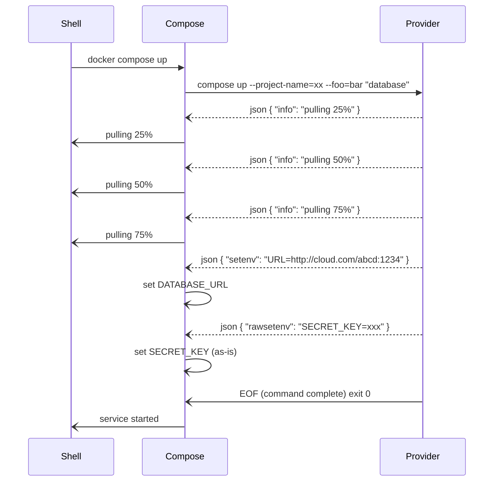
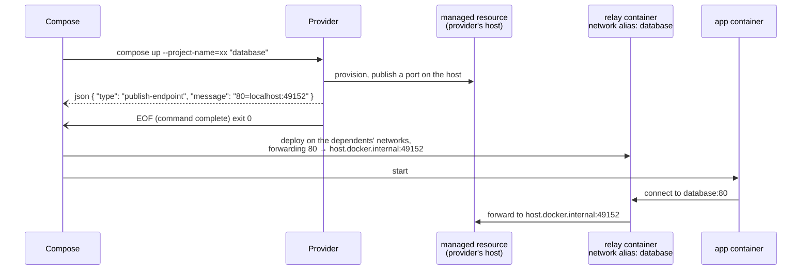

# About

The Compose application model defines `service` as an abstraction for a computing unit managing (a subset of)
application needs, which can interact with other services by relying on network(s). Docker Compose is designed 
to use the Docker Engine ("Moby") API to manage services as containers, but the abstraction _could_ also cover 
many other runtimes, typically cloud services or services natively provided by host.

The Compose extensibility model has been designed to extend the `service` support to runtimes accessible through
third-party tooling.

# Architecture

Compose extensibility relies on the `provider` attribute to select the actual binary responsible for managing
the resource(s) needed to run a service.

```yaml
  database:
    provider:
      type: awesomecloud
      options:
        type: mysql
        size: 256
        name: myAwesomeCloudDB
```

`provider.type` tells Compose the binary to run, which can be either:
- Another Docker CLI plugin (typically, `model` to run `docker-model`)
- An executable in user's `PATH`

If `provider.type` doesn't resolve into any of those, Compose will report an error and interrupt the `up` command.

To be a valid Compose extension, provider command *MUST* accept a `compose` command (which can be hidden)
with subcommands `up` and `down`. It *MAY* additionally implement a `stop` subcommand to support `docker compose stop`,
and a `pull` subcommand to take part in image distribution (see [Image distribution](#image-distribution)).
Optional subcommands are declared through the provider metadata: the presence of the command block is what
opts the provider in.

## Up lifecycle

To execute an application's `up` lifecycle, Compose executes the provider's `compose up` command, passing 
the project name, service name, and additional options. The `provider.options` are translated 
into command line flags. For example:
```console
awesomecloud compose --project-name <NAME> up --type=mysql --size=256 "database"
```

> __Note:__ `project-name` _should_ be used by the provider to tag resources
> set for project, so that later execution with `down` subcommand releases 
> all allocated resources set for the project.

## Communication with Compose

Providers can interact with Compose using `stdout` as a channel, sending JSON line delimited messages.
JSON messages MUST include a `type` and a `message` attribute.

An unknown message type fails the command: a provider that requires a message the running Compose does not
support must fail loudly rather than degrade silently. To let a provider adapt instead, Compose announces the
message types it accepts in the `COMPOSE_PROVIDER_MESSAGES` environment variable of the provider process, as a
comma-separated list (e.g. `error,info,setenv,rawsetenv,debug,publish-endpoint,get-service-config,get-relay-info`):
check membership before emitting an optional message.
```json
{ "type": "info", "message": "preparing mysql ..." }
```

`type` can be either:
- `info`: Reports status updates to the user. Compose will render message as the service state in the progress UI
- `error`: Lets the user know something went wrong with details about the error. Compose will render the message as the reason for the service failure.
- `setenv`: Lets the plugin tell Compose how dependent services can access the created resource. The variable is automatically prefixed with the service name. See next section for further details.
- `rawsetenv`: Same as `setenv`, but the variable is injected as-is without the service name prefix. Useful when applications require exact variable names that cannot be altered.
- `debug`: Those messages could help debugging the provider, but are not rendered to the user by default. They are rendered when Compose is started with `--verbose` flag.
- `get-service-config`: Asks Compose for the resolved configuration of the service the provider manages. See next section.
- `get-relay-info`: Asks Compose what address a locally-run endpoint should bind so the relay deployed for this
  service can reach it — Compose owns the platform knowledge, the provider just binds what is announced. Only
  meaningful for a provider running its service **locally**; a provider backing the service with a remote
  resource never needs it. See [Binding a local endpoint for the relay](#binding-a-local-endpoint-for-the-relay).
- `publish-endpoint`: Declares where a network endpoint of the provider's resource is actually reachable. The
  message is `"<container-port>=<host>:<port>"` — the port consumers know on the left, the real location on the
  right, as seen FROM THE PROVIDER'S HOST (typically a port published on the host):
  ```json
  { "type": "publish-endpoint", "message": "80=localhost:49152" }
  ```
  TCP only; the message may be repeated, one per port. When a provider publishes at least one endpoint, Compose
  deploys a relay container in place of the service so that dependents reach the resource at the compose-native
  address — see [Compose-native addressing with `publish-endpoint`](#compose-native-addressing-with-publish-endpoint).

## Requesting the service configuration

A provider can ask the running Compose process for the resolved definition of the service it manages —
the exact model Compose is executing, not a re-resolution. The request is a regular JSON line on `stdout`:
```json
{ "type": "get-service-config" }
```

Compose answers on the provider's `stdin` with one JSON line: the resolved, canonical JSON of the service —
the same shape as this service's entry in `docker compose config --format json`, after interpolation and
normalization:
```json
{ "image": "mysql:8", "environment": { "...": "..." } }
```

There is no parameter: a provider can only obtain the definition of its own service. The message can be sent
several times; each occurrence is answered with one line.

Compose versions that predate this message treat it as a protocol error and abort the command, and never
write anything to the provider's `stdin` (the provider reads EOF). A provider that requires the service
configuration should treat EOF as "this Compose version does not support provider requests" and report an
actionable error; a provider that can operate without it should simply not send the message.


```mermaid
sequenceDiagram
    Shell->>Compose: docker compose up
    Compose->>Provider: compose up --project-name=xx --foo=bar "database"
    Provider--)Compose: json { "info": "pulling 25%" }
    Compose-)Shell: pulling 25%
    Provider--)Compose: json { "info": "pulling 50%" }
    Compose-)Shell: pulling 50%
    Provider--)Compose: json { "info": "pulling 75%" }
    Compose-)Shell: pulling 75%
    Provider--)Compose: json { "setenv": "URL=http://cloud.com/abcd:1234" }
    Compose-)Compose: set DATABASE_URL
    Provider--)Compose: json { "rawsetenv": "SECRET_KEY=xxx" }
    Compose-)Compose: set SECRET_KEY (as-is)
    Provider-)Compose: EOF (command complete) exit 0
    Compose-)Shell: service started
```

## Image distribution

A provider-backed service can declare `build` or `image` like any other service; the image then has to reach
the provider's runtime, which may be nowhere near the local daemon. Providers opt into image distribution by
declaring a `pull` block in their `metadata` output — like `stop`, the presence of the block is the
declaration of support. Providers without it keep managing images on their own during `up`.

When the provider declares `pull`, Compose invokes it during the image phase of `up` (after any build) and on
`docker compose pull`:

```console
awesomecloud compose --project-name <NAME> pull --image=<ref> --source=<verdict> --policy=<policy> [--digest=<id> --created=<time>] "database"
```

- `--image`: the image reference as Compose resolved it (the `image` attribute, or `<project>-<service>` for a
  build-only service).
- `--digest` / `--created`: the state of the **local daemon cache**, present only when the image exists there.
  They describe the cache, they are not instructions: persist them as the bookkeeping keys of what you ingest —
  the digest as identity test, `created` as the ordering fallback for a backend that cannot preserve digests.
  Beware that reproducible builds can freeze `created`, so a comparable digest always wins over it.
- `--source` is the authority verdict, computed by Compose from the model and the invocation (`pull_policy`,
  `--build`, what the current run just built), so providers never re-implement that arbitration:
  - `local`: the desired state is the local daemon's image. Compare your bookkeeping with the announced
    digest/created; when they differ, request the bytes with `get-image`.
  - `registry`: resolve the reference upstream — this includes the common workflow where `build` is only the
    recipe CI uses to publish the image that consumers pull. The local facts are an optimization, never an
    obligation.
- `--policy`:
  - `missing` (the `up` path): a usable version present in your runtime suffices;
  - `always` (`docker compose pull`): ensure your runtime holds the latest version of the authority.

### Requesting the image bytes

During `pull`, the provider can ask Compose for the image content with a regular JSON line on `stdout`
(`platform` is optional and narrows a multi-platform image):

```json
{ "type": "get-image", "message": "<image ref>", "platform": "linux/arm64" }
```

Compose answers on the provider's `stdin` with one JSON line:

```json
{ "type": "image-stream", "encoding": "chunked", "media-type": "application/x-tar" }
```

followed — unless the line carries an `error` field instead — by the image tar encoded as HTTP/1.1 chunked
data (RFC 9112 §7.1): every block of data prefixed by its length, terminated by the zero-length chunk. Unlike
an HTTP message there is no trailer section nor final CRLF — the next byte after the zero chunk belongs to the
next stdin answer. Length-prefixed framing needs no in-band delimiter (any byte value can appear inside a tar), and
any language's stock chunked-body reader consumes it — Go providers can use `httputil.NewChunkedReader`. A
stream that ends without the terminating zero chunk was aborted and must be discarded — Compose closes the
answer channel after an aborted transfer, so the truncation is always observable as EOF. The tar is what
`docker image save` produces: feed it to `docker load` or whatever your runtime ingests.

As during `stop`, any `setenv`, `rawsetenv` or `publish-endpoint` message emitted during `pull` is accepted
but ignored: dependent services are not being configured in this phase.

The stream is exclusive on `stdin` for its whole duration — the chunked body must be contiguous, so answers to
any other request emitted meanwhile are delivered after it. Drain the announced stream completely before
expecting another answer.

## Connection to a service managed by a provider

A service in the Compose application can declare dependency on a service managed by an external provider: 

```yaml
services:
  app:
    image: myapp 
    depends_on:
       - database

  database:
    provider:
      type: awesomecloud
```

When the provider command sends a `setenv` JSON message, Compose injects the specified variable into any dependent service,
automatically prefixing it with the service name. For example, if `awesomecloud compose up` returns:
```json
{"type": "setenv", "message": "URL=https://awesomecloud.com/db:1234"}
```
Then the `app` service, which depends on the service managed by the provider, will receive a `DATABASE_URL` environment variable injected
into its runtime environment.

When the provider command sends a `rawsetenv` JSON message, Compose injects the variable as-is without any prefix:
```json
{"type": "rawsetenv", "message": "SECRET_KEY=xxx"}
```
The `app` service will receive `SECRET_KEY` exactly as specified, regardless of the provider service name.
This is useful when injecting secrets or configuration values that must match exact variable names expected by
applications or frameworks.

Unlike `setenv`, which avoids collisions through automatic prefixing, `rawsetenv` keys are the provider's
responsibility to keep unique. If a `rawsetenv` key collides with a variable already set on the dependent service,
the existing value is overwritten and Compose logs a warning. This includes variables declared by the user in the
service `environment` section as well as values emitted by other providers. Providers that are not linked by a
`depends_on` relationship may run concurrently, so when several of them emit the same `rawsetenv` key the resulting
value is not deterministic.

> __Note:__  The `compose up` provider command _MUST_ be idempotent. If resource is already running, the command _MUST_ set
> the same environment variables to ensure consistent configuration of dependent services.

### Compose-native addressing with `publish-endpoint`

Environment-variable injection makes the consumer aware of the provider: the application has to read
`DATABASE_URL` instead of connecting to `database` the way it would reach any container-backed service. When the
provider's resource is reachable through a TCP endpoint, `publish-endpoint` removes that coupling: the provider
declares where each port of the resource is actually reachable, and Compose deploys a **relay container** in
place of the service. Dependents then connect to the compose-native address — `<service>:<container-port>`,
e.g. `http://database:80` — with no injected variables involved, so the same application configuration works
whether the service runs as a container or through a provider.


```mermaid
sequenceDiagram
    participant Compose
    participant Provider
    participant resource as managed resource<br/>(provider's host)
    participant relay as relay container<br/>network alias: database
    participant app as app container

    Compose->>Provider: compose up --project-name=xx "database"
    Provider->>resource: provision, publish a port on the host
    Provider--)Compose: json { "type": "publish-endpoint", "message": "80=localhost:49152" }
    Provider-)Compose: EOF (command complete) exit 0
    Compose->>relay: deploy on the dependents' networks,<br/>forwarding 80 → host.docker.internal:49152
    Compose->>app: start
    app->>relay: connect to database:80
    relay->>resource: forward to host.docker.internal:49152
```

The provider reports each endpoint as seen from its own host — typically a port published on `localhost` — and
does not need to know how containers reach that host: the relay translates a loopback (or unspecified) upstream
host into `host.docker.internal` — resolved through the `host-gateway` extra_host Compose injects — while
routable addresses pass through untouched.

The relay is a minimal TCP forwarder (`docker/compose-relay` — set `COMPOSE_RELAY_IMAGE` to pull the image from
an internal registry instead of Docker Hub) joining the networks of the services that depend on the provider
service, aliased with the service name. It is a regular project container (standard compose labels, canonical
`<project>-<service>-1` name), so `ps`, `logs`, `stop` and `down` treat it as the service; it additionally
carries the `com.docker.compose.relay` label identifying its role, and process-level commands (`exec`, `cp`)
refuse it. The relay is recreated when the published endpoints change, and removed by `down` like any project
container.

### Binding a local endpoint for the relay

A provider that runs its service **on the local host** has to pick the address its endpoint binds, and on a
standalone Linux engine no address is both relay-reachable and off the LAN by default: `host.docker.internal`
resolves there to the bridge gateway, which a loopback-only listener cannot accept, while the wildcard exposes
the port on every host interface. (Docker Desktop has no such dilemma — its proxy reaches the host's loopback.)

`get-relay-info` resolves this: the provider asks, and Compose answers with one JSON line listing the networks
the relay would join — the dependents' networks, as selected for the relay deployment — each with the address a
locally-run endpoint should bind so the relay can reach it:

```json
{ "type": "get-relay-info" }
```

```json
{"networks":[{"name":"myproject_default","gateway":"172.18.0.1"}]}
```

Compose owns the platform knowledge behind that address: on a standalone engine it is the network's gateway —
an address the provider's host owns on that network's bridge, reachable from the relay (and from local
containers) but not from the LAN; under Docker Desktop it is `127.0.0.1` — the network lives inside the VM,
and the host's own loopback is, factually, where a host process is reached through the Desktop proxy. The
provider simply binds the announced gateway and publishes the endpoint exactly as bound: a routable address
passes to the relay untouched, a loopback one is announced as `localhost` (translated to
`host.docker.internal`). The `gateway` field may be absent when it cannot be resolved (exotic network drivers,
IPv6-only IPAM): fall back to a bind of your choice. Best-effort by design.

## Down lifecycle

`down` lifecycle is equivalent to `up` with the `<provider> compose --project-name <NAME> down <SERVICE>` command.
The provider is responsible for releasing all resources associated with the service.

## Stop lifecycle

When the user runs `docker compose stop`, Compose invokes `<provider> compose --project-name <NAME> stop <SERVICE>` for each
provider-backed service in reverse dependency order. The provider should pause the resource without releasing it, so a later
`docker compose up` can resume it (note that `docker compose start` only restarts existing containers and does not invoke
provider hooks). Any `setenv` or `rawsetenv` JSON message returned during `stop` is ignored, since dependent services are also stopping.

The `stop` hook is opt-in: Compose invokes it only when the provider declares a `stop` block in its `metadata` subcommand
output. Providers that do not advertise `stop` in metadata (or do not implement the `metadata` subcommand at all) are
silently skipped during `docker compose stop`, preserving backward compatibility with providers that pre-date this hook.

The `--timeout` flag of `docker compose stop` applies only to container services; provider stop hooks are not subject to
this timeout and are responsible for managing their own shutdown duration.

## Provide metadata about options

Compose extensions *MAY* optionally implement a `metadata` subcommand to provide information about the parameters accepted by the `up` and `down` commands.  

The `metadata` subcommand takes no parameters and returns a JSON structure on the `stdout` channel that describes the parameters accepted by both the `up` and `down` commands, including whether each parameter is mandatory or optional.

```console
awesomecloud compose metadata
```

The expected JSON output format is:
```json
{
  "description": "Manage services on AwesomeCloud",
  "up": {
    "parameters": [
      {
        "name": "type",
        "description": "Database type (mysql, postgres, etc.)",
        "required": true,
        "type": "string"
      },
      {
        "name": "size",
        "description": "Database size in GB",
        "required": false,
        "type": "integer",
        "default": "10"
      },
      {
        "name": "name",
        "description": "Name of the database to be created",
        "required": true,
        "type": "string"
      }
    ]
  },
  "down": {
    "parameters": [
      {
        "name": "name",
        "description": "Name of the database to be removed",
        "required": true,
        "type": "string"
      }
    ]
  },
  "stop": {
    "parameters": [
      {
        "name": "name",
        "description": "Name of the database to be stopped",
        "required": true,
        "type": "string"
      }
    ]
  },
  "pull": {
    "parameters": []
  }
}
```
The top elements are:
- `description`: Human-readable description of the provider
- `up`: Object describing the parameters accepted by the `up` command
- `down`: Object describing the parameters accepted by the `down` command
- `stop`: Object describing the parameters accepted by the `stop` command (optional)
- `pull`: Object describing the parameters accepted by the `pull` command (optional — declaring the block is
  what opts the provider into [image distribution](#image-distribution); the flags Compose injects need not be
  listed)

And for each command parameter, you should include the following properties:
- `name`: The parameter name (without `--` prefix)
- `description`: Human-readable description of the parameter
- `required`: Boolean indicating if the parameter is mandatory
- `type`: Parameter type (`string`, `integer`, `boolean`, etc.)
- `default`: Default value (optional, only for non-required parameters)
- `enum`: List of possible values supported by the parameter separated by `,` (optional, only for parameters with a limited set of values)

This metadata allows Compose and other tools to understand the provider's interface and provide better user experience, such as validation, auto-completion, and documentation generation.

## Examples

See [example](examples/provider.go) for illustration on implementing this API in a command line 
