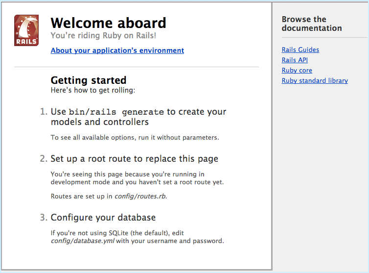

<!--[metadata]>
+++
title = "Quickstart: Compose and Rails"
description = "Getting started with Docker Compose and Rails"
keywords = ["documentation, docs,  docker, compose, orchestration, containers"]
[menu.main]
parent="workw_compose"
weight=5
+++
<![end-metadata]-->

## Quickstart: Docker Compose and Rails

This Quickstart guide will show you how to use Docker Compose to set up and run a Rails/PostgreSQL app. Before starting, you'll need to have [Compose installed](install.md).

### Define the project

Start by setting up the three files you'll need to build the app. First, since
your app is going to run inside a Docker container containing all of its
dependencies, you'll need to define exactly what needs to be included in the
container. This is done using a file called `Dockerfile`. To begin with, the
Dockerfile consists of:

    FROM ruby:2.2.0
    RUN apt-get update -qq && apt-get install -y build-essential libpq-dev nodejs
    RUN mkdir /myapp
    WORKDIR /myapp
    ADD Gemfile /myapp/Gemfile
    ADD Gemfile.lock /myapp/Gemfile.lock
    RUN bundle install
    ADD . /myapp

That'll put your application code inside an image that will build a container
with Ruby, Bundler and all your dependencies inside it. For more information on
how to write Dockerfiles, see the [Docker user guide](/engine/userguide/containers/dockerimages.md#building-an-image-from-a-dockerfile) and the [Dockerfile reference](/engine/reference/builder.md).

Next, create a bootstrap `Gemfile` which just loads Rails. It'll be overwritten in a moment by `rails new`.

    source 'https://rubygems.org'
    gem 'rails', '4.2.0'

You'll need an empty `Gemfile.lock` in order to build our `Dockerfile`.

    $ touch Gemfile.lock

Finally, `docker-compose.yml` is where the magic happens. This file describes
the services that comprise your app (a database and a web app), how to get each
one's Docker image (the database just runs on a pre-made PostgreSQL image, and
the web app is built from the current directory), and the configuration needed
to link them together and expose the web app's port.

    version: '2'
    services:
      db:
        image: postgres
      web:
        build: .
        command: bundle exec rails s -p 3000 -b '0.0.0.0'
        volumes:
          - .:/myapp
        ports:
          - "3000:3000"
        depends_on:
          - db

### Build the project

With those three files in place, you can now generate the Rails skeleton app
using `docker-compose run`:

    $ docker-compose run web rails new . --force --database=postgresql --skip-bundle

First, Compose will build the image for the `web` service using the `Dockerfile`. Then it'll run `rails new` inside a new container, using that image. Once it's done, you should have generated a fresh app:

      $ ls -l
      total 56
      -rw-r--r--   1 user  staff   215 Feb 13 23:33 Dockerfile
      -rw-r--r--   1 user  staff  1480 Feb 13 23:43 Gemfile
      -rw-r--r--   1 user  staff  2535 Feb 13 23:43 Gemfile.lock
      -rw-r--r--   1 root  root   478 Feb 13 23:43 README.rdoc
      -rw-r--r--   1 root  root   249 Feb 13 23:43 Rakefile
      drwxr-xr-x   8 root  root   272 Feb 13 23:43 app
      drwxr-xr-x   6 root  root   204 Feb 13 23:43 bin
      drwxr-xr-x  11 root  root   374 Feb 13 23:43 config
      -rw-r--r--   1 root  root   153 Feb 13 23:43 config.ru
      drwxr-xr-x   3 root  root   102 Feb 13 23:43 db
      -rw-r--r--   1 user  staff   161 Feb 13 23:35 docker-compose.yml
      drwxr-xr-x   4 root  root   136 Feb 13 23:43 lib
      drwxr-xr-x   3 root  root   102 Feb 13 23:43 log
      drwxr-xr-x   7 root  root   238 Feb 13 23:43 public
      drwxr-xr-x   9 root  root   306 Feb 13 23:43 test
      drwxr-xr-x   3 root  root   102 Feb 13 23:43 tmp
      drwxr-xr-x   3 root  root   102 Feb 13 23:43 vendor

If you are running Docker on Linux, the files `rails new`  created are owned by
root. This happens because the container runs as the root user. Change the
ownership of the the new files.

      sudo chown -R $USER:$USER .

If you are running Docker on Mac or Windows, you should already have ownership
of all files, including those generated by `rails new`. List the files just to
verify this.

Uncomment the line in your new `Gemfile` which loads `therubyracer`, so you've
got a Javascript runtime:

    gem 'therubyracer', platforms: :ruby

Now that you've got a new `Gemfile`, you need to build the image again. (This,
and changes to the Dockerfile itself, should be the only times you'll need to
rebuild.)

    $ docker-compose build

### Connect the database

The app is now bootable, but you're not quite there yet. By default, Rails
expects a database to be running on `localhost` - so you need to point it at the
`db` container instead. You also need to change the database and username to
align with the defaults set by the `postgres` image.

Replace the contents of `config/database.yml` with the following:

    development: &default
      adapter: postgresql
      encoding: unicode
      database: postgres
      pool: 5
      username: postgres
      password:
      host: db

    test:
      <<: *default
      database: myapp_test

You can now boot the app with:

    $ docker-compose up

If all's well, you should see some PostgreSQL output, and then—after a few
seconds—the familiar refrain:

    myapp_web_1 | [2014-01-17 17:16:29] INFO  WEBrick 1.3.1
    myapp_web_1 | [2014-01-17 17:16:29] INFO  ruby 2.2.0 (2014-12-25) [x86_64-linux-gnu]
    myapp_web_1 | [2014-01-17 17:16:29] INFO  WEBrick::HTTPServer#start: pid=1 port=3000

Finally, you need to create the database. In another terminal, run:

    $ docker-compose run web rake db:create

That's it. Your app should now be running on port 3000 on your Docker daemon. If you're using [Docker Machine](/machine/overview.md), then `docker-machine ip MACHINE_VM` returns the Docker host IP address.

>**Note**: If you stop the example application and attempt to restart it, you might get the
following error: `web_1 | A server is already running. Check
/myapp/tmp/pids/server.pid.` One way to resolve this is to delete the file
`tmp/pids/server.pid`, and then re-start the application with `docker-compose
up`.

## More Compose documentation

- [User guide](index.md)
- [Installing Compose](install.md)
- [Getting Started](gettingstarted.md)
- [Get started with Django](django.md)
- [Get started with WordPress](wordpress.md)
- [Command line reference](./reference/index.md)
- [Compose file reference](compose-file.md)
