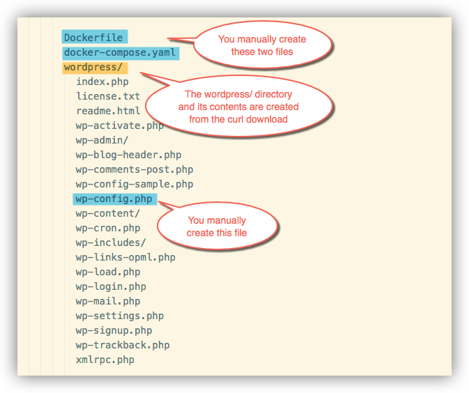
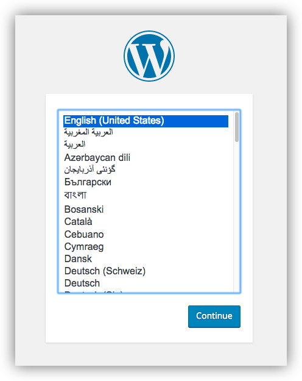
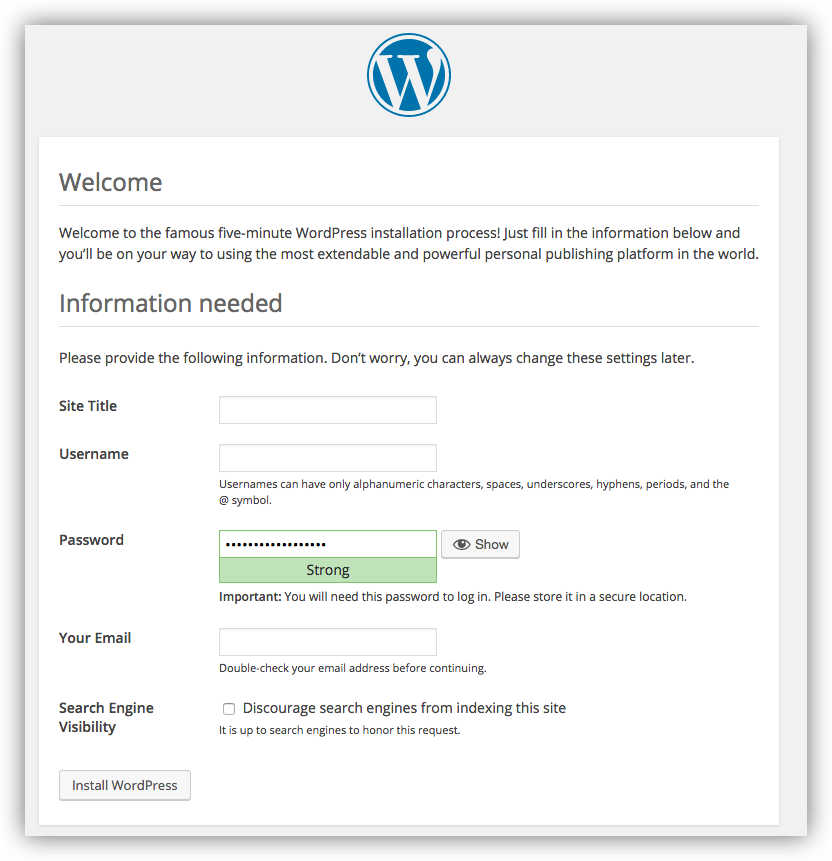

<!--[metadata]>
+++
title = "Quickstart: Compose and WordPress"
description = "Getting started with Compose and WordPress"
keywords = ["documentation, docs,  docker, compose, orchestration, containers"]
[menu.main]
parent="workw_compose"
weight=6
+++
<![end-metadata]-->

# Quickstart: Docker Compose and WordPress

You can use Docker Compose to easily run WordPress in an isolated environment built
with Docker containers. This quick-start guide demonstrates how to use Compose to set up and run WordPress. Before starting, you'll need to have
[Compose installed](install.md).

## Define the project

1. Create an empty project directory.

    You can name the directory something easy for you to remember. This directory is the context for your application image. The directory should only contain resources to build that image.

    This project directory will contain a `Dockerfile`, a `docker-compose.yaml` file, along with a downloaded `wordpress` directory and a custom `wp-config.php`, all of which you will create in the following steps.

2. Change directories into your project directory.

    For example, if you named your directory `my_wordpress`:

        $ cd my-wordpress/

3. Create a `Dockerfile`, a file that defines the environment in which your application will run.

    For more information on how to write Dockerfiles, see the [Docker Engine user guide](https://docs.docker.com/engine/userguide/dockerimages/#building-an-image-from-a-dockerfile) and the [Dockerfile reference](https://docs.docker.com/engine/reference/builder/).

    In this case, your Dockerfile should include these two lines:

        FROM orchardup/php5
        ADD . /code

    This tells the Docker Engine daemon how to build an image defining a container that contains PHP and WordPress.

4. Create a `docker-compose.yml` file that will start your web service and a separate MySQL instance:

        version: '2'
        services:
          web:
            build: .
            command: php -S 0.0.0.0:8000 -t /code/wordpress/
            ports:
              - "8000:8000"
            depends_on:
              - db
            volumes:
              - .:/code
          db:
            image: orchardup/mysql
            environment:
              MYSQL_DATABASE: wordpress

5. Download WordPress into the current directory:

        $ curl https://wordpress.org/latest.tar.gz | tar -xvzf -

    This creates a directory called `wordpress` in your project directory.

6. Create a `wp-config.php` file within the `wordpress` directory.

    A supporting file is needed to get this working. At the top level of the wordpress directory, add a new file called `wp-config.php` as shown. This is the standard WordPress config file with a single change to point the database configuration at the `db` container:

        <?php
        define('DB_NAME', 'wordpress');
        define('DB_USER', 'root');
        define('DB_PASSWORD', '');
        define('DB_HOST', "db:3306");
        define('DB_CHARSET', 'utf8');
        define('DB_COLLATE', '');

        define('AUTH_KEY',         'put your unique phrase here');
        define('SECURE_AUTH_KEY',  'put your unique phrase here');
        define('LOGGED_IN_KEY',    'put your unique phrase here');
        define('NONCE_KEY',        'put your unique phrase here');
        define('AUTH_SALT',        'put your unique phrase here');
        define('SECURE_AUTH_SALT', 'put your unique phrase here');
        define('LOGGED_IN_SALT',   'put your unique phrase here');
        define('NONCE_SALT',       'put your unique phrase here');

        $table_prefix  = 'wp_';
        define('WPLANG', '');
        define('WP_DEBUG', false);

        if ( !defined('ABSPATH') )
          define('ABSPATH', dirname(__FILE__) . '/');

        require_once(ABSPATH . 'wp-settings.php');
        ?>

7. Verify the contents and structure of your project directory.
<!--
        Dockerfile
        docker-compose.yaml
        wordpress/
          index.php
          license.txt
          readme.html
          wp-activate.php
          wp-admin/
          wp-blog-header.php
          wp-comments-post.php
          wp-config-sample.php
          wp-config.php
          wp-content/
          wp-cron.php
          wp-includes/
          wp-links-opml.php
          wp-load.php
          wp-login.php
          wp-mail.php
          wp-settings.php
          wp-signup.php
          wp-trackback.php
          xmlrpc.php
      -->

    

### Build the project

With those four new files in place, run `docker-compose up` from your project directory. This will pull and build the needed images, and then start the web and database containers.

If you're using [Docker Machine](https://docs.docker.com/machine/), then `docker-machine ip MACHINE_VM` gives you the machine address and you can open `http://MACHINE_VM_IP:8000` in a browser.

At this point, WordPress should be running on port `8000` of your Docker Host, and you can complete the "famous five-minute installation" as a WordPress administrator.

## More Compose documentation

- [User guide](index.md)
- [Installing Compose](install.md)
- [Getting Started](gettingstarted.md)
- [Get started with Django](django.md)
- [Get started with Rails](rails.md)
- [Command line reference](./reference/index.md)
- [Compose file reference](compose-file.md)
